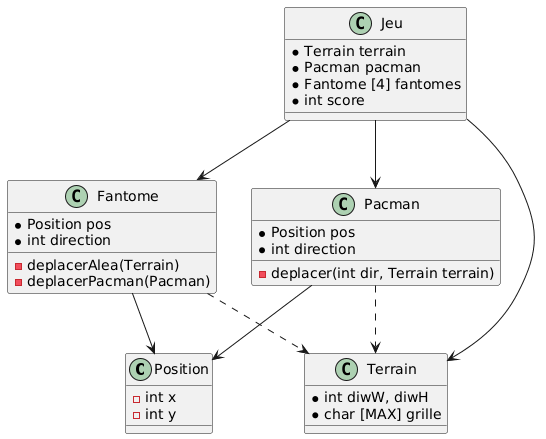

+++
title = 'td1'
draft = false
+++

# PlantUML notation:

**utilisation** : fleche pointille `..>`
**instanciation**: fleche pleine `<--`

les profs en projets vont verifier ssi on utilies correctement les include (pas en trop notamment)

les inclusions se font en cascade:si on inclut f1, qui inclus f2, pas besoin dinclure f2(c deja inclus)

la grande difference c quand on utilise, on a pas forcement besoin dinstancier (plus rare)

# le parc de voitures

## Diagramme UML des classes

solution:

Pour savoir le sens des fleches c
A a besoin de quelque chose dans B: A->B

a savoir que quand on veut comparer il faut systematiquement creer loperateur < et ==

on peut mettre des accesseurs/mutateurs quand il y en a des utiles pour lutilisateur de la classe (pas des prives)

un accesseur permets dacceder en prive

- c public

* c prive

si notre classe A utilise les attributs dun objet dune classe B => on inclut A dans B

si notre classe A utilise un pointeur sur un objet dune classe B => on sen bat les couilles

## DIAGRAMME DIMPORTS

la 2eme partie de cet exercice permets deviter de faire des imports circulaires
pour eviter de se retrouver dans des situations ou on se demande ou est la classe originale, on utilise une dummy class

petite precision: le diagramme de gantt quon va faire en debut de projet va etre different quen fin de projet (donc trkl)

voiture.h
conducteur.h
-> date.h
Voiture.h
-> conducteur.h
VoitureParc.h
Voiture.h
-> TabDyn.h

ParcDeVoiture.cpp -> Voiture.h
Voiture.cpp -> Conducteur.h

# PACMAN

On doit se fixer sur un objectif pour le mi projet

Avant dintegrer des fonctionnalites, il faut penser a faire des mini implementations des dites fonctionnalites (pour comprendre comment marche le code)

## Diagramme de classe

on sappercoit que pacman et fantome vont partager beaucoup de point commun : on peut aller creer une super classe (entite)
sans parler dheritage, on va juste dire que pacman et fantome sont des classes qui ont un attribut entite

le diagramme de classe:

