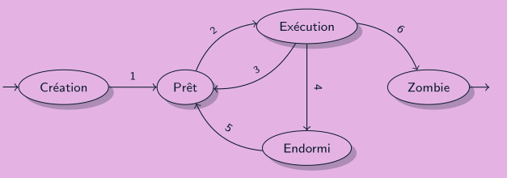

+++
title="processus"
draft = false
+++

# rappels

on a vu en LIFARCHI, que le processeur ne peut pas faire beaucoup de choses en
meme temps: en fonction du nombre de coeur, de 1 a 8 instructions peuvent etre
executes en meme temps
Or, le nombre de programmes executes sur un ordinateur peut s'averer etre assez
grand: actuellement sur mon ordinateur j'ai 340 programmes qui tournent.

Pour voir les programmes qui tournent:

```bash
ps
```

## Processus et ses caracteristiques

Un processus est une abstraction pour designer un programme en cours d’exécution.

Un processus est un identifie par un PID (Process IDentifier)

Un executable corresponds a un processus.
L'ensemble des processus sous UNIX corresponds a un arbre:

> un nouveau processus est forcément la copie d’un processus existant
>
> cm

Pour voir l'arbre des processus:

```bash
pstree
```

Pour creer un processus fils, on utilise l'appel `fork()`

### creer un nouveau processus

On va voir 2 manieres de creer un nouveau processus

#### fork()

quand on fait fork, c comme si on ouvrait un autre terminal et quon executait le
meme executable

> fork creer un nouveau processus. ce dernier est une replique exacte
>
> manpages

Un processus consomme des ressources tant qu'on a pas enregistre le fait qu'il
s'est arrete

#### exec()

permets d'appeller un programme (depuis le programme avec cet appel)
cest une famille de fonction: execl, exelp, execle...
under the hoods, exec remplace le process

les redirections de flux par exemples utilise ceci

### terminaison dun processus

Un processus se termine de deux manieres:

- exécutant un `return()` dans sa fonction `main()`,
- en faisant appel à la fonction void `exit(int status)`.

Mais notre probleme de base n'est pas resolu pour autant:
une fois finis le processus devient **zombie** (occupe des ressources,
attends que le processus quil a appelle ait enregistre l'info qu'il est ete termine)

il y a plusieurs forme de processus finis:

- zombie (quand le processus decide de s'arreter et que son pere n'a pas encore
  vu sa terminaison)
- orphelin (aucun, c systemd qui le recupere)=> cas particulier

lors de lexecution, un processus peut etre:

- pret (en attente detre execute)
- endormi (`sleep`, ou `waitpid`)

### comment voir la terminaison d'un processus

avec `waitpid()`

on rappellera que le c++ est imperatif, cest a dire que lexecution se fait ligne
par ligne...
donc si on fait un appel avec opt = 0, on bloque sur l'appel

## comment gerer ces processus

et c grace a l'**ordonnancement**: le systeme choisi a quels processus il accorde
son temps et son energie

### etats possibles pour un processus



### interruptions (et signaux)

L'utilisateur ainsi que le systeme dipose d'outils pour manipuler l'execution d'un
processus.
Notamment les signaux, et plus particulierement les signaux d'interruption.

Tout les processeurs peuvent recevoir le signal d'arreter d'executer un programme.

```bash
man signal.7 #tout les differents signaux possibles
man signal.3 #la bibliotheque signal.h
```

### comment comprendre top

[cliquez ici](./top) pour en apprendre un peu plus sur la signification des
colonnes de `top`

installer `htop` se fait ainsi:

```zsh
sudo apt install htop
```

htop supporte l'usage de la souris, la couleur, ce qui le rends beaucoup plus
convivial a l'usage

## definition

**Processus**: Programme qui tourne + seulement ce qui est associe
**Ordonancement**: Action de l'OS de choisir quel processus sexecute a un temps t
**PID**: Parent Identifier
**PPID**: Parent Process Identifier
**Systemd**: le processus qui appelle les processus
**Systemd**: le processus qui appelle les processus (ancienne version)
**TTY**:Entree de Terminal (historiquement un moyen d'envoyer du texte a une ligne
telephonique)
