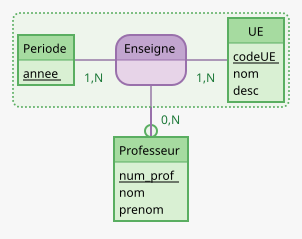

# exercice 1

interpreter et transformer un schema E/A

## vrai/faux+ justif

### guesses

- vrai sinon date_embauche serait dans professeur (bah non jai mal lu les cardinalites)
- vrai ya du N partout
- faux puisque nom c la cle primaire
- vrai car c une entite faible (elle peut avoir plusieurs fois la meme valeur)

une entite faible est identifie par son nom ET son universite de rattachement

- vrai car nom c pas la cle primaire

**en base ca veut dire en base de donness**

## transformation

Universite(_nom_,adresse)
Departement(_#nomUniv_,_nom_,domaine)
Professeur(_num_prof_,nom, prenom, date_embauche)
TravaillePour(_#nomUniv_,_#nom_,_#nom_prof_)

# semantique

## 1)

difficulte d'archivage
aucun attribut de date

si on rajoute annee dans enseigne, ca va poser probleme pour les cas des profs qui enseignent plusieurs fois la meme UE.

## 2)

beaucoup de redondance (apparament ca derange pas)

## 3)

bah autant mettre le prof dans lUE dcp

# transformation encore

## Guess

https://www.mocodo.net/?mcd=eNpNjsEKgzAMhu99ij5AkXn1JjUTQatUHd6kzAwEraOVsb39anVMAklI_vz5Ulm2FUR6mUlcVbFsQGSS0a6jJbQ3Cb5NvYhELoiEOM9q2DVOn9UN0NMB2UtEnSXbUsrWcTXI6NOMb0aV1oi9QZwm3B0Pk42BvUY37rUarVX6jsyuHyfjpeAgxQ7Dy6KIRQLnn94nIr-Vf86XeVZ6wCAgyZXRMPxf9hdNeZ6BaGpy1INXDQat9bD4QIOOwZIv73dVJQ==
