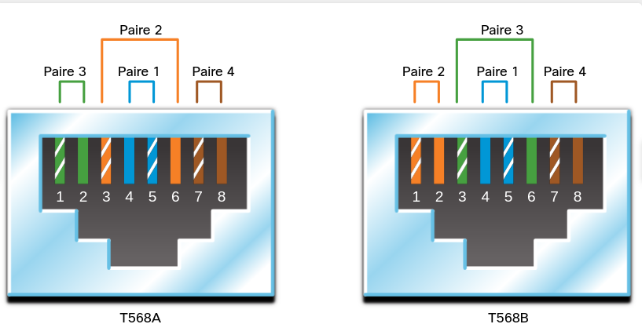
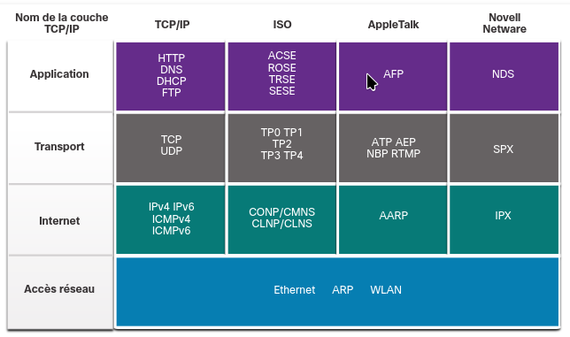
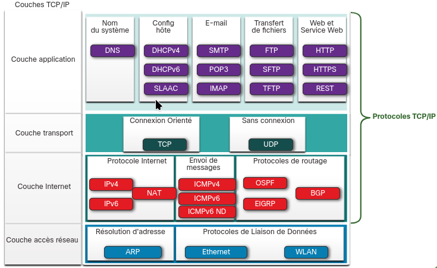
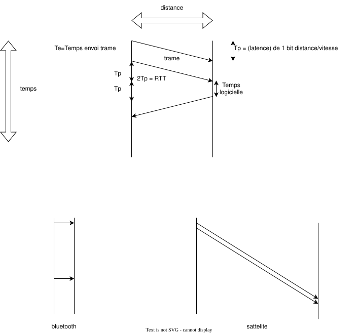

# competences requises pour cisco

- fondements ip
- question de securite
- sans fil
- virtualisation
- automatisation
- programmabilite des reseaux
 competences requises pour cisco

virtual packet tracer

- 2.8
..


# telecommunication (communication lointaine)

> toutes technique de transfert d'information(= n'importe quoi de comprehensible par l'humain)

est decrit par le protocole: c-a-d l'ensemble des regles

des que plusieurs ordinateurs se parlent, il y a tout une chiee de protocole.
c une architecture protocolaire

> un protocole: format de message, algorithme, comportement
plus precisement selon cisco:

- codage
- format
- taille
- sync
controle de flux (bit/s),delai de reponse, methode d'access
- options de remises des messages

## entite qui communiquent

client, hotes, peripheriques finaux, terminaux

quand ils ont une adresse IP, c pour identifier sur un resesau, et identifier le reseau en lui meme

quand les ordinateurs nont pas besoin dune sur entite autoritaire, ils parlent en p2p

NIC:hote->reseau
Port:?->? (avant et apres la fleche)
interface:?->reseau

### systeme d'exploitation

materiel>noyau>interpreteur de commandes (cli/gui)

un firmware melange plus noyau et interpreteur de commandes

### acces a un terminal

console (hors connexion, cable ?, tty,modele logiciel/console)
AUX (use, port qui utilise des cables telephoniques)
ssh (securise,puissant, modele client serveur)
telnet(pas securise bouh)

emulateurs de terminals recommandes par cisco
- secure crt
- putty
- tera term

###  CISCO ios

### configuration sur windows

#### changer l'adress IP
control panel>network sharing centre>change adaptater settings>properties

aera connectin properties>cliquer sur IPV4>properties

#### afficher la config reseau dun pc sur windows

`C:\ipconfig`

#### syntaxe

invite: type de materiel

invite(commande) arguments|motcle

##### documentation

**gras**: mot cle, commandes
_Italique_: argument avec valeur
[]:element facultatif
{}:element requis
[{|}]:element requis dans un element facultatif

mode d'aide contextuelle dispo en tapant `?`

on peut aussi completer les commandes en tapant ? a la finj


#### raccourcis clavier
| Touche | Description |
|---|---|
| **Tabulation** | Complète un nom de commande entré partiellement. |
| **Retour arrière** | Efface le caractère à gauche du curseur. |
| **Ctrl+D** | Efface le caractère à l'emplacement du curseur. |
| **Ctrl+K** | Efface tous les caractères à partir du curseur jusqu'à la fin de la ligne de commande. |
| **Échap D** | Efface tous les caractères à partir du curseur jusqu'à la fin du mot. |
| **Ctrl+U** ou **Ctrl+X** | Efface tous les caractères à partir du curseur jusqu'au début de la ligne de commande. |
| **Ctrl+W** | Efface le mot à gauche du curseur. |
| **Ctrl+A** | Déplace le curseur vers le début de la ligne. |
| **Touche fléchée vers la gauche** ou **Ctrl+B** | Déplace le curseur d'un caractère vers la gauche. |
| **Échap B** | Déplace le curseur d'un mot vers la gauche. |
| **Échap F** | Déplace le curseur d'un mot vers la droite. |
| **Flèche droite** ou **Ctrl+F** | Déplace le curseur d'un caractère vers la droite. |
| **Ctrl+E** | Déplace le curseur vers la fin de la ligne. |
| **Haut** ou **Ctrl+P** | Rappelle les commandes antérieures en commençant par les plus récentes. |
| **Ctrl+R** ou **Ctrl+I** ou **Ctrl+L** | Rappelle l'invite du système et la ligne interrompue par la réception d'un message IOS. |

dans `more`

|touche entree|ligne suivante|
|barre espace|ecran suivant|
|Ctrl+C|config->#|

#### modes de commandes

beaucoup de commandes qui sont dans des modes ! attention

- view only (>) ->disable
- super use (#) ->enable
- config mode ((config)) -> configure terminal

a partir de config, beaucoup de modes de configuration disponible.
pour sortir dun mode de config, CTRL+Z ou **exit**
pour sortir du mode de config, **end**

- config de ligne (line) `line <type> <numero>`
- config dinterface (if) `interface <type> <numero>`

exit sors du sous mode de configuration

## information

ce qui veut communiquer

### types de donnes (physique)

- donnees continue
- donnees discretes (quil faudra echantilloner)

donc codage, echantillonage, numerisation


## traitement d'information

branche entiere de l'informatique qui se fait pour convertir le message en binaire, puis tout se binaire est transmis sur des supports analogiques.
donc la aussi, ya du traitement, de signal...

on peut prendre en compte les interferences et predire les changements que ca a cree


### systeme de nombre

... []()


## adaptateur

etant donne que cette communication se fait de loin, les deux communicateurs doivent utiliser un **adapatateur**(pour adapter son message)

plus simple de transmettre de l'info avec un signal analogique (le 5V sur 200km c pas trop possible)

dans la meme idee c le cas avec le wifi et le telephone (on a tous une frequence differente)

### exemples

bonne vieille carte reseau ou un boitier DMX si on veut etre niche

### proprietes

- distance
- environnement
-quantite
-cout

### cable


type de cable:

#### cable ethernet
4 paires de fil, doit etre repete.
un cable peut etre arme/blinde
- cable non arme
les fils sont doubles pour renforcer le signal (et eviter le cross talk)

si on double les fils, c pour envoyer 1 signal et son contraire. cela va grandement reduire les interferences
et quand on les torsades, on le fait differement pour mieux les differencier

les connecteurs,longueur, terminaison,test des cables sont normes par la norme TIA/EIA-568

ils sont mesures en Cat(3,5,5e,6,7,8)

|3|cable telephonique a la base. pas torsade|
|5|<100Mbps|
|5e|<1000Mbps|
|6|1 isolant en plus. <1Gb/s|
|6a|en fait c cat7|
|7|<10Gbps|
|8|<Gbps|

##### croise ou pas ?

c en terme de disposition des signaux

|droit|A-A ou B-B|hote<->periph|
|croise|B-A ou A-B|periph reseau<->periph reseau|
|inverse|?|exclusif a cisco

paire 1 - bleu
paire 2 - orange
paire 3 - vert
paire 4 - marron

les impaires sont celle avec du blanc autour
les paires sont celles qui sont uni




#### coaxial: contre les interferences, bande passante, grande dispo
deux conducteurs qui partagent le meme axe:
 - 1 qui transmets
 - 1 isolants
 - 1 feuille metallique (reduit les interferences)
 - 1 cable protecteur

connecteurs: plusieurs connecteurs utilises
- BNC
- N
- F
les antennes en vrai c ca

transmets linfo via des pulsions de courant
il connait des interferences electromagnetiques, ainsi que des interferences radio.
c generalement du a cause du cable a cote (crosstalk)

#### fibre optique

on balance de la lumiere dans un tube compose dune matiere qui la reflechit
cependant il peut y avoir des pertes

cisco se focalisera sur lusage de la fibre en entreprise, dans des racks

##### coeur

-SMF (monomode)
un seul coeur fin, cher a produire
doit navoir quun rayon
-mmf (multimode)
le rayon entre dans plusieurs angle
possible dutiliser des leds
efficace mais pas pour de longues distances


##### usage

ftth : fiber to the home
divers longue distance
local a un reseau d'entreprise

##### connecteur

- Straight Tip:
verouillage avec une bayonnette

- Subscriber Connector
mecanisme d'encliquetage

- Lucent Connector
connecteur lumineux, plus petit ?
simplex

- Lucent Connector bidirectionnel
duplex

##### duplex

la fibre peut etre duplex grace a des cables bidirectionnelle ou en utilisant plusieurs longueurs d'onde


DSL:telephonique, bande passante
aDSL: down > up
celullaire: longue distance, vite limite (terminal/antenne)
satellite: region,
ligne commute: partage de co
fibre optique: 30 bornes sans repeteur (petsam)
**les suivants c pour le business**
ligne loue dediee:..
metro ethernet:techno specifique
business adsl:up=down
satellite:quand pas de cable

### sans fil

#### limites

- couverture(affecte par le batis)
- interferences
- securite (necessite aucun support physique)
- support partage (half duplex)

### repeteur

boitier qui re amplifie le signal


## reseau

### protocoles

l'architecture protocolaire definit 3 couches:
applicatif, transport, liaison

*bla bla sur le fait que les protocoles, c tres important*
*bla bla sur l'encapsulation*

#### Types de ces protocoles

Aident ils a communiquer entre des reseaux?
- beaucoup trop mdr
Aident ils a securiser les reseaux?
- SSH, TLS, SSL
Aident ils les reseaux a acheminer (router) l'information ?
- OSPF
Aident ils a acceder des machines ?
- DHCP, DNS

#### Fonctions de ces protocoles

(aussi decrit par le modele OSI)
- adressage

identifier expediteur/destinataire
necessaire pour le sequencage
plusieurs types d'adresse:

pour comprendre ce quil se passe dans les paquets, on utilise wireshark

- adresses physique (MAC)
- adresses logiques (IPs)
- numeros de ports (penser au mail..)


- fiabilite
mecanisme de livraison garanti
- controle de flux
rythme efficace
sequencage
pour reconstruire correctement les paquets
- detection des erreurs
c dans le nom ahah
- interface
si des protocoles sont intermediaires a l'application

il faut voir les protocoles dans un systeme de couche

et il est important de comprendre qu'il ya des protocoles reserves pour les terminaux (bout a bout) et ceux intermediaires, de routeur a routeur par exemple (point a point)

#### cas des suites de protocoles 

protocoles faits pour marcher en pile.
donc assez concu dans cette demarche la.



##### TCP/IP

geree par la IETF (surement pas trop achetee)
- le plus courant
- a connaitre le plus
- suivies par les industriels
- libre evidemment (bizzarement c celui qui marche le mieux)

##### pile osi

fait en respectuant le plus le modele OSI.
on prefere cependant tcp/ip.

##### modeles proprietaires

appletalk (courte duree), netware (courte duree), minitel,dmx :p

### OSI

bien repartager les infos avec la section protocoles
1 couche = 1 protocole
Chaque couche, après avoir réalisé son travail et ajouté ses informations aux
données de la couche supérieure transmet son message à la couche inférieure pour qu’elle réalise à son tour le travail qui est attendu d’elle

Une fois que l’entête a été fabriquée pour réaliser la fonction de la couche trois, on procède à l’encapsulation.
Cela consiste à ajouter l’entête H3 aux données à transférer (en gris) que nous notons D3 et à les regrouper
sous forme d’une unité de données de niveau trois qui vont devenir les données de la couche 2 soit D2. Ainsi,
D2=H3+D3. Ces données D2 sont transmises à la couche d’en dessous, ici la couche 2. Ainsi, l’en-tête de niveau
trois et les données de niveau trois deviennent les données de niveau deux.

En réception, les instructions permettent de passer les données de la couche N à la couche N+1 en enle-
vant l’entête de la couche N qui a été lu par la couche N. Ainsi, on retrouve deux types de dialogue sur ce
schéma.
Dn = Hn+1 + Dn+1

#### couches et les protocoles associes

alors on est bien daccord, comme vu precedemment, ces protocoles ne sont pas des protocoles OSI.
On a juste garde le modele OSI pour des raisons pedagogiques.

en cisco on utilise un modele simplifie a 4 couches:


##### couche 1: physique

3 fonctions principales:

- composants physiques

tout composant qui fait le lien entre 1 periph et 1 un autre, ou qui le permettent (radio)
connecteurs, interfaces etc

- encodage

toute technique pour convertir un message binaire pour la transmission
plus il ya de donnees plus c complique

- signaux

doit pouvoir transmettre le signal precedemment encode

on parle en bits

qqch dimportant

###### Ethernet (802.3)

transmission de signaux
definit des regles concernant le cablage et un peu de signalisation

|802.3u|Fast Ethernet|
|802.3z|Gigabit Ethernet (Fibre)|
|802.3ab|Gigabit Ethernet (Cuivre)|
|802.3ae|10 Gigabit Ethernet (Fibre)|

taille min/max:
64o/1518o

schema dune trame:


###### Wifi (802.11)

Regle de signalisation des signaux (c de la physique mdr)

- prevention des collisions(csma/ca)

###### Bluetooth (802.15),
(HDLC)
1-100m

###### WiMAX (802.16)

techno point a multipoint
utilise une large bande

###### ZigBee (802.15.4)

normes pour les objets iOT, ou :
- courte portee
- debit faible
- longue autonomie

##### couche 2: transmission/liaison

soccupe de la bonne communication entre deux cartes reseaux (aka, des supports qui transmettent les sequences binaires)

###### trame

1. En tete
- indicateur de debut
- adressage
- protocole de couche 3
- controle (priorite)

2. Paquet

- donnee utile

3. Queue de bande
- detection des erreurs (padding)
indicateur de fin de trame

###### roles de la couche 2

- detection d'erreur
- accepte les donnees de la couche 3 encapsule correctement
- traitement de donnes, embrayage
- des/encapsulation de trame,

on parle ici de trame (unite)

il ya deux cas de figure: soit on est sur le peripherique de destination, ou pas
mais dans tout les cas c tcp/ip qui gere la desencapsulation

tout les protocoles utilises pour des reseaux de non grande echelle:
- man/lan
- pan
- wlan/wpan

ils ne sont pas geres par les RFC/IETF

--- 

###### PPP (ancien)
###### HDLC (ancien)
###### Frame Relay (ancien)
###### ATM (ancien)
###### X.25 (ancien)

###### ARP

fournis un protocole pour faire le lien entre
adresse physique (concrete)<->adresse IP (virtuelle)

(avec des messages pour demander MDR C KI KI A FAIT SA)

###### sous couche LLC (802.2)

communique avec le materiel
place les infos dans la trame

###### sous couche MAC (sous couche de controle daccess au support)

trame mac: destination-source

le protocole MAC est le plus proche du materiel.

elle empeche la surcharge du materiel en:

- detectant les erreurs
- adressage
- delimitation des trames

les adresses mac sont physiquement incorporees dans la carte reseau.
une adresse mac est compose de 6 couples de chiffre hexadecimaux

elle va donc agir differement selon le type de transfert (fichier multimedia), et la position du peripherique sur le reseau (\#topologie)


###### HDLC


----

tout ces protocoles seffectuent dans la carte reseau/cables

##### couche 3: reseau

la on parlera de paquet (unite)

###### ICMP

protocoles de controle (soccupe des retours ips notamment)

on aussi le ICMP ND pour soccupe de faire en sorte quil y ait pas des voisins

###### IP

soccupe donc dacheminer le reseau
2 parties: 1 pour identifier la machine, 1 autre pour identifier lorigine de la machine.
tout les machines d'un meme resesau partage la meme adresse reseau

1 paquet ip est constitue d'une adresse source et d'une adresse destination

source puis destination

####### IPV4

- adresse 32 bits
1 partie reseau/1 partie hote
on utilise un masque reseau

####### IPV6

- adresse 128 bits
1 prefixe/1 id d'interface
on utilise un prefixe-longueur


###### NAT

traduis adresse prive (visible que a une echelle local) <-> adresse publique (commune pour tout le monde)


###### OSPF

protocole de routage qui ouvre le chemin le plus rapide. fais ca du global au local

###### EIGRP

protcole de routage proprietaire entre les machine cisco. mesure les choses differement.

###### BGP

protocole utilise dans le routage des adresses prive<->publiques


---

donc voila on des supers couches dites point a point
le reste est utile juste pour le terminal

##### couche 4: transport

soccupe de commencer des grands trajets etc..
on parle de segments ici.

###### TCP

tcp il s'assure que tout arrive a destination (et retransmets si jamais c pas le cas)

tcp = fiabilite

####### algorithme du tcp

 envoyer le fichier en une succession de paquets
- envoyer un « checksum » pour chaque paquet
- contrôler le checksum sur le récepteur et renvoyer un message OK ou Not-OK à l’émetteur
- l’émetteur attend le OK ou Not-OK avant de demander le transfert du paquet suivant
- l’émetteur attend le dernier message OK avant de clore la connexion
- si Not-OK pour un paquet, re-transférer le paquet

###### UDP
- fait un checksum, mais pas de retransmission

---

ces protocoles se font dans le systeme dexploitation

##### couche 5: session

TCP aussi (gere tout ce qui concerne les ports par exemple)

###### XDR

##### couche 6: presentation

tout les trucs quon voit pas encore (ssl)
on parle de donnes ici

###### RCP

##### couche 7: application

tout ce qui est fait pour que lhumain capte linformation

###### TelNet

###### SSH

###### DNS

###### NFS

###### HTTP

sert a envoyer des requetes/reponses pour les pages internet

###### DNS

nommer des machines

###### DHCP

le dhcp sert a attribuer des adresses dynamiquement (remplit des fonctions d'extensibilite ;)

---

ces protocoles agissent dans lapplication


##### LES SCIENCES DU LANGAGE MDR

TSAIS POUR QUON SE COMPRENNE LOL


### tendances

#### BYOD

- affecte la securite
- impose aux reseaux de permettre lutilisation de tout terminal (pour lutilisation du reseau en lui meme)

#### Collaboration en ligne

- message instantanee

#### Communications videos

- meeting room>video calls room

#### Cloud Computing

- infrastructure reseau en tant que tel
tout les users se retrouvent a se connecter a des machines situes sur un seul site
cisco parle de datacenters privee/publics/hybrides/communeautes

les datacentres de communeaute sont souvent deployes pour des besoin communs (sante, militaires..)

#### reseau sur courant electrique
#### reseau par le sans fil (antenne 5G) (WISP) (WISP)

#### internet des objets

### caracteristiques

#### tolerance aux pannes
*redondance*:plusieurs chemins->1 destination
ce quil se passe, cest que A decoupe en plusieurs fois son message, et ses bouts de message prennent plein de chemins differents.

#### evolutivite/extensible

est il simple dagrandir ce dit reseau ?
> pour ca il faut suivre des normes/protocoles (ca permets de la modularite)

#### Quality of Service

**Encombrement**:demande excessive sur de la bande passante, impliquent que les appareils se brident
geres par les routeurs

un exemple de politique de QoS cest favoriser ludp plus que le tcp

#### Securite

Empecher des intrusions (physiques/logicielles)

pour ca, on a des admin, a qui on exigent detre confidentielle, integre, disponible

type de reseau:
convergents, VoIP..
separes (fax+tel+internet)

menaces dites externes:

- virus, vers, chevaux de troie: non consenties par luser
- spy/adware: consenties par luser
- attaque du jour 0: des que des failles 0 day sont decouvertes..
- attaques de deni de service: ralentit et bloque par connexion repete
- interception/vol de donnes
- usurpation didentite

menaces dites internes:

un employe qui attaque le reseau de sa boite pour viser que des gens de sa boite

moyens de se proteger:

antivirus: detecte les checksums/comportements des virus connus par les boites
par feu: filtre lentree et la sortie dun reseau. dediees ou non.
est pratique pour empecher des employes daller sur internet
ACL:autorise ou non, des chemins tcp (dun port a lautre par exemple)
preventions des intrusions (IPSys): detecte les comportements qui se rependant sur le reseau
VPN: fournit un chemin securise (tant que c proche de A et B)

### transmission

on distingue le simp-,half dup,dup lex
qui peut envoyer/recevoir de la donnee


### acteur d'un reseau

- régénérer et retransmettre les signaux de communication
- gérer des informations indiquant les chemins qui existent à travers le réseau et l'interréseau
- indiquer aux autres périphériques les erreurs et les échecs de communication
- diriger des données vers d'autres chemins en cas d'échec de liaison
- classifier et diriger des messages en fonction des priorités
- autoriser ou refuser le flux de données, selon des paramètres de sécurité.

#### routeur,sans fil

passe d'un reseau l'autre
il a des fonctions en plus

ceux de cisco utilisent cisco IOS, mais aussi IOS XE, IOS XR, NX-OS

#### switch/commutateurs

relie plusieurs ordinateurs entre eux

mais il peuvent communiquer entre eux

<!-- exemple de routeur lan-wan renater, reseau amplivi@ -->

#### configuration dacteurs du reseau dans cisco

mode de configuration globale

\#**configure terminal**: aller dans le mode de configuration globale 
\#(config):**interface** {num}:aller dans le mode de configuration de l'interface {num}
\#(config-if):ip adress {adress machine} {adresse reseau}
\#(config-if):no shutdown:allume linterface resesau selection
(config)#**hostname {nom}**: configure un nom 
(config-line)**password** {mot de passe} : access utilisateur
(config-line)**login**: active le mot de passe
(config)#**enable secret** {mot de passe} : access admin
(config)#ip default-gateway {adresse}
(config)#**service password-encryption** : securise laccess aux mot de passe
\#**show running-config** : montre la config (et mot de passe si pas chiffre)
(config)# banner motd {message}**: configure le **message of the day**
(config?)# **copy** {source} {destination} : copie des fichiers
\#reload:**restaure** la config de demerrage
(?)#? **erase** {fichier}:supprime un fichier
#show {fichier} : **affiche un fichier**
#ping : verifie une connexion

2fichiers de configuration
-**startup-config**
config charge au demarrage
-**running-config**
config en cours

pour la sauvegarde, on ecrase la config en cours dans celle de demarrage


### fonctions des reseaux

#### commutation

#### signalisation

on distingue les liaisons
- point a point (une seule et meme ligne)
- multipoint, ce qui implique...

#### administration et gestion

pour eviter les coupures de parole
politique dacces au support 
de nos jours, tout est en duplex, donc pas de galere

##### maitre esclave

##### mode politesse

##### mode jeton

##### csma/cd

cmsa: carrier sense multiple access

le peripherique d'ecouter sa liaison et de dire si il ya deja utilisation du reseau.

```
SI utilisation_reseau
>elle peut emettre
```

on appelle collision lorsque les deux supports s'envoient simultanement des messages, ce qui detruit les messages

si la latence est suffisante pour brouiller la detection d'utilisation du reseau,

##### csma/ca

plus previsionneux
plus utilise dans les technos sns fils

### reseaux particuliers

cisco parle d'**infrastructure de reseaux**

#### intranet

un reseau pas interconnecte avec dautres reseaux

#### extranet

un extra d'internet : des services fournis a des clients
un petit bout dinternet, valides, securise, fournis a des employes
#### internet

= tout internet

### echelle des reseaux

WAN,PAN etc.. (revoir les definitions slide 30)

-La taille de la zone couverte
-Le nombre d'utilisateurs connectés
-Le nombre et les types de services disponibles
-Le domaine de responsabilité

#### Reseaux WAN

ils relient des LAN
- 2 acteurs: isp, sp (service provide, cable etc)

##### connexions physiques des WANs

###### point a point

la plus courante. lien permanent entre 2 routeurs.

###### hub & spoke

designe les gros sites qui en cachent d'autre.
concept de site central qui va connecter des sites en points a points

###### maillee

n liaisons point a point

---

### topologie d'un reseau

#### topologie en bus

toutes les hotes sont relies en formant une chaine
exactement comme le DMX
pas besoin de routeur

#### topologie en anneau

dans certains equipements: exemple, des capteurs
on essaie dobtenir ca pour relier des villes: pour eviter de faire marseille-bordeaux en passant par paris... (ce serait trop "etoile")
utilise dans les reseaux FDDI et Token Ring

#### topologie en maille

redondance et tolerence aux pannes
c ce quon trouve dans des routeurs, commutateurs
plutot au milleu
(encore mieux quanneau finalement)
_eeee_

#### topologie en etoile

plutot aux extremites

### proprietes d'un reseau <3

ces grandeurs nont pas de lien entre
on choisit un reseau selon les attentes/besoin



#### debit

aussi appelle rapidite

*quantite de bits par seconde*

|10^3|Kilo|
|10^6|Mega|
|10^9|Giga|
|10^12|Tera|

a ne pas confondre avec le debit utile qui est le debit en prenant en compte tout un processus de connexion

#### latence

*temps entre lenvoi du bit et la reception du bit*

le gps a une grosse latence
50/100ms

le bluetooth en a une toute petite

#### fiaibilite

---

debit max theorique min(le debit max des noeuds) => bottleneck
debit utile = temps quil nous a fallu par rapport a la quantite

ya une notion d'efficacite evidemment dans le calcul du debit reel (les non pertes)


## entite qui regule

(je drop ca la)
il vaut mieux prevenir les utilisateurs quels access doivent etre restreint, pour pouvoir les poursuivre en justice si ils trouvent un access

### protocoles,algorithmes

ISOC: promeuts le libre, regule
IAB: designe des taches
IETF: trouve des solutions concretes (RfC notamment)
IRTF: cherche des nouvelles solutions

### adressage, nommage

ICANN: attribution des numeros (telephones,adresse IPv4...)
plutot politique

IANA: bosse pour l'icann
plutot technique

### electronique, physique

IEEE: protocoles, normes de trucs essentiels
EIA: consortium de boite pour des trucs moins essentiels
TIA: plus specialise dans les telecom (consortium dentreprise)
UIT-T:telecom (union internation)

## representer les reseaux

merde cisco

### logique

theoriquement

### physique

concretement
