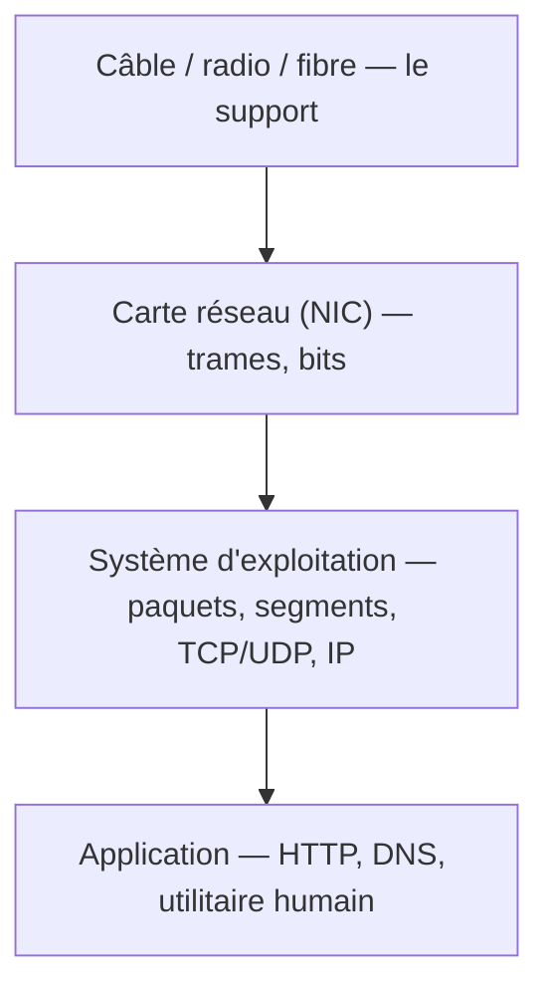

# Réseaux & Cisco IOS — Cours réorganisé

## 🧭 Comment lire ce cours

L'organisation suit **la profondeur dans la machine** : on part du câble, du signal et de la carte réseau, et on remonte couche par couche jusqu'à l'application. Chaque notion est donc toujours située par rapport au matériel.

Deux types d'encadrés traversent le document :

- **📍 Protocole** — une implémentation concrète, avec *où elle s'exécute* (carte réseau, système d'exploitation, application, etc.).
- **💡 Concept** — une idée abstraite, définie *hors de tout protocole*, puis située : *où on la rencontre en pratique* (ex. le *piggybacking*, défini en général, puis appliqué à HDLC).

Repère de profondeur, du bas vers le haut :

---

# Partie 0 — Fondations

## 0.1 Télécommunication

La **télécommunication** est toute technique de transfert d'information, l'information étant *n'importe quoi de compréhensible par l'humain*.

Dès que plusieurs ordinateurs se parlent, un ensemble de **protocoles** entre en jeu : c'est une *architecture protocolaire*.

Un **protocole** est l'ensemble des règles de communication : *format des messages, algorithme, comportement*. Selon Cisco, un protocole définit :

- le **codage**,
- le **format** et la **taille** des messages,
- la **synchronisation** et le **contrôle de flux** (bit/s, délai de réponse, méthode d'accès),
- les **options de remise** des messages.

## 0.2 Entités qui communiquent

- **Client, hôte, périphérique final, terminal** : la même chose vue de différents angles. Ce sont les *choses qui veulent communiquer*.
- Quand un hôte a une **adresse IP**, elle sert à l'identifier sur un réseau *et* à identifier le réseau lui-même.
- Quand les machines n'ont pas besoin d'une entité autoritaire centrale, elles parlent en **peer-to-peer (P2P)**.
- Vocabulaire matériel : le **NIC** (*Network Interface Card*) fait le lien hôte → réseau ; le **port** est la prise physique ; l'**interface** est le point d'attache au réseau (terme Cisco).

## 0.3 Système d'exploitation et accès au terminal

Hiérarchie logicielle : **matériel > noyau > interpréteur de commandes** (CLI ou GUI). Un **firmware** mélange noyau et interpréteur de commandes.

Accès à un terminal :

| Méthode | Remarques |
| --- | --- |
| **Console** | hors connexion, câble direct (TTY, port console logiciel) |
| **AUX** | port utilisant des câbles téléphoniques |
| **SSH** | sécurisé, puissant, modèle client-serveur |
| **Telnet** | non sécurisé (à éviter) |

Émulateurs de terminal recommandés par Cisco : **SecureCRT**, **PuTTY**, **Tera Term**.

## 0.4 Organisations qui régissent le tout *(pour situer qui décide de quoi)*

- **ISOC** : promeut le libre, régule l'ensemble.
- **IAB** : désigne les tâches.
- **IETF** : trouve des solutions concrètes (les **RFC** notamment).
- **IRTF** : cherche de nouvelles solutions.
- **ICANN** : attribution des numéros (adresses IPv4…), plutôt *politique*.
- **IANA** : travaille pour ICANN, plutôt *technique*.
- **IEEE** : protocoles et normes essentiels (802.x).
- **EIA / TIA** : consortiums d'entreprises, normes matérielles (TIA/EIA-568 pour le câblage).
- **UIT-T** : télécoms (union internationale).

---

# Partie 1 — Le support physique (le tout bas de la machine)

## 1.1 Données, signal, adaptation

Types de données **physiques** :

- données **continues** (analogiques),
- données **discrètes** (à échantillonner).

D'où la chaîne : **codage → échantillonnage → numérisation**. Le *traitement de l'information* (branche entière de l'informatique) convertit le message en binaire, qui est ensuite transmis sur des supports analogiques. On peut prendre en compte les **interférences** et prédire les changements qu'elles créent (traitement du signal).

Comme la communication se fait de loin, les deux communicateurs ont besoin d'un **adaptateur** — pour adapter son message au support. Il est plus simple de transmettre de l'information par signal analogique (envoyer du 5 V sur 200 km n'est pas vraiment possible) ; même logique pour le Wi-Fi et le téléphone, où chacun utilise une fréquence différente.

Exemples : la bonne vieille carte réseau, ou un boîtier DMX si on veut être de niche. Propriétés de choix d'un adaptateur : **environnement, quantité, coût**.

## 1.2 Câble Ethernet (paires torsadées)

4 paires de fil, doit être répété (un câble peut être armé/blindé).

- Câble **non armé** : les fils sont *torsadés* par paires pour renforcer le signal et éviter le *crosstalk*.
- On envoie un signal **et son contraire** sur chaque paire : cela réduit fortement les interférences ; les torsades sont faites différemment selon la paire pour mieux les différencier.

Connecteurs, longueur, terminaison et tests sont normés par **TIA/EIA-568**. Les catégories :

| Catégorie | Débit / usage |
| --- | --- |
| Cat 3 | câble téléphonique à la base, non torsadé |
| Cat 5 | < 100 Mbps |
| Cat 5e | < 1000 Mbps |
| Cat 6 | un isolant en plus, < 1 Gb/s |
| Cat 6a | équivalent Cat 7 |
| Cat 7 | < 10 Gbps |
| Cat 8 | < 40 Gbps |

**Droit ou croisé ?** Cela se joue sur la disposition des signaux :

| Type | Disposition | Usage |
| --- | --- | --- |
| Droit | A-A ou B-B | hôte ↔ périphérique |
| Croisé | B-A ou A-B | périphérique réseau ↔ périphérique réseau |
| Inverse | — | exclusif Cisco |

Ordre des paires : **1 bleu, 2 orange, 3 vert, 4 marron**. Les conducteurs impairs sont ceux avec du blanc autour ; les paires sont repérées par les conducteurs unis. Les schémas de câblage sont **T568A** et **T568B**.

## 1.3 Câble coaxial

Contre les interférences, grande bande passante, grande disponibilité. Deux conducteurs qui partagent le même axe :

1. un conducteur qui transmet,
2. un isolant,
3. une feuille métallique (réduit les interférences),
4. un câble protecteur.

Connecteurs : **BNC**, **N**, **F** (les antennes, en vrai, c'est ça).

Il transmet l'information via des impulsions de courant, et connaît des interférences électromagnétiques et radio, généralement dues au câble voisin (*crosstalk*).

## 1.4 Fibre optique

On envoie de la lumière dans un tube composé d'une matière qui la réfléchit ; il peut y avoir des pertes. Cisco se focalise sur l'usage en entreprise, dans des racks.

**Cœur :**

- **SMF** (monomode) : un seul cœur fin, cher à produire, le rayon ne doit avoir qu'une trajectoire. Longue distances.
- **MMF** (multimode) : le rayon entre sous plusieurs angles ; on peut utiliser des LED. Efficace mais pas pour de longues distances.

**Usage :** FTTH (*Fiber To The Home*), diverses longue distances, local à un réseau d'entreprise.

**Connecteurs :**

- **ST** (*Straight Tip*) : verrouillage à baïonnette.
- **SC** (*Subscriber Connector*) : mécanisme d'encliquetage.
- **LC** (*Lucent Connector*) : plus petit ; version *simplex* ou *duplex* bidirectionnelle.

**Duplex :** la fibre peut être duplex grâce à des câbles bidirectionnels ou en utilisant plusieurs longueurs d'onde.

## 1.5 Autres liaisons filaires

- **DSL** : sur ligne téléphonique ; **ADSL** : débit descendant > débit montant (et **SDSL** : montant = descendant).
- **Cellulaire** : longue distance, vitesse limitée (terminal ↔ antenne).
- **Satellite** : grande couverture régionale ; grosse latence ; utile quand aucun câble n'arrive.
- **Ligne commutée** : support partagé.
- **Ligne louée dédiée**, **Metro Ethernet** : technologies plutôt *business*.
- **Réseau sur courant électrique** (*powerline*).

## 1.6 Sans fil

**Limites :**

- **couverture** (affectée par le bâti),
- **interférences**,
- **sécurité** (aucun support physique nécessaire),
- **support partagé** (half duplex).

💡 **Concept — Répéteur** : boîtier qui réamplifie le signal quand le support physique s'atténue. On le rencontre sur tous les supports : câble, Wi-Fi, fibre.

---

# Partie 2 — Couche 1 : Physique *(bits — exécuté dans la carte réseau et le câble)*

Trois fonctions principales :

- **Composants physiques** : tout élément qui fait le lien entre deux périphériques (connecteurs, interfaces, radio…).
- **Encodage** : toute technique pour convertir un message binaire pour la transmission — plus il y a de données, plus c'est compliqué.
- **Signaux** : transmettre le signal précédemment encodé.

On parle **en bits**.

## 2.1 Ethernet (IEEE 802.3)

Définit les règles de cablage et de signalisation.

| Norme | Nom |
| --- | --- |
| 802.3u | Fast Ethernet |
| 802.3z | Gigabit Ethernet (fibre) |
| 802.3ab | Gigabit Ethernet (cuivre) |
| 802.3ae | 10 Gigabit Ethernet (fibre) |

Taille d'une trame : **min 64 o / max 1518 o**. Schéma d'une trame Ethernet : préambule (avertissement de préparation), adresse MAC destination, adresse MAC source, IP source, IP destination, données, fin de trame.

## 2.2 Autres normes de la couche physique

- **Wi-Fi (802.11)** : règles de signalisation ; prévention des collisions (CSMA/CA).
- **Bluetooth (802.15)** : 1–100 m.
- **WiMAX (802.16)** : point à multipoint, large bande.
- **ZigBee (802.15.4)** : objets IoT — courte portée, débit faible, longue autonomie.

---

# Partie 3 — Couche 2 : Liaison *(trames — exécuté dans la carte réseau)*

Cette couche existe parce que les supports physiques ne suffisent pas. On parle **en trames**.

Caractéristiques d'une liaison : **simplex / half / full duplex** (deux cartes peuvent-elles parler en même temps ?) et **point à point / multipoint**.

## 3.1 Politique d'accès au support *(qui a le droit de parler ?)*

De nos jours, tout est en full duplex, donc peu de friction — mais il faut connaître les mécanismes :

- **Maître-esclave** : un équipement donne la parole.
- **Mode politesse** : chaque équipement écoute avant de parler.
  - **CSMA/CD** (*Carrier Sense Multiple Access / Collision Detection*) : le périphérique écoute sa liaison ; si le réseau est libre, il émet. Une **collision** survient quand deux supports émettent simultanément, ce qui détruit les messages. Le CD fonctionne si la latence est suffisante pour détecter l'utilisation du réseau — donc surtout sur support filaire.
  - **CSMA/CA** : plus prévisionnel, utilisé dans les technologies sans fil.
- **Mode jeton** : la parole circule équitablement (Token Ring).

## 3.2 Structure d'une trame

1. **En-tête** : indicateur de début, adressage, protocole de couche 3, contrôle (priorité).
2. **Paquet** : donnée utile.
3. **Queue de bande** : détection d'erreurs (padding), indicateur de fin de trame.

**Rôles de la couche 2 :** détection d'erreur, traitement des données (embrayage), dé/encapsulation de trames, contrôle de flux (politiques anti-surcharge, *go/stop*).

La couche 2 encapsule des **paquets** (couche 3) dans des **trames**, ensuite décomposées en bits. Deux cas de figure en réception : soit on est sur le périphérique de destination, soit non — dans tous les cas, c'est la pile TCP/IP qui gère la désencapsulation.

Protocoles de couche 2 pour réseaux locaux : **MAN/LAN, PAN, WLAN/WPAN**. Les protocoles de couche 2 ne sont pas gérés par les RFC/IETF. Protocoles **WAN** : Frame Relay, ATM, X.25 *(anciens)*.

## 3.3 Adressage MAC

📍 **ARP** — *exécuté dans la carte réseau.* Fait le lien entre adresse physique (concrète) et adresse IP (virtuelle), en diffusant des messages Ethernet pour demander qui possède une IP (avec l'adresse MAC de diffusion).

Sous-couches :

- **LLC (802.2)** : communique avec le matériel, place les infos dans la trame.
- **MAC** : contrôle d'accès au support, la plus proche du matériel. Trame MAC : *destination – source*. Elle évite la surcharge du matériel en détectant les collisions, en gérant l'adressage et la délimitation des trames.

**Adresse MAC** : 6 octets (6 couples de chiffres hexadécimaux), physiquement incorporée dans la carte réseau :

- les **3 premiers octets** : définis par le constructeur,
- les **3 derniers octets** : varient selon le périphérique.

À chaque trame reçue, celle-ci est analysée, puis ignorée ou utilisée. La couche MAC agit différemment selon le type de transfert (fichier, multimédia) et la position du périphérique sur le réseau (*topologie*).

Adresses MAC spéciales :

| Adresse | Rôle |
| --- | --- |
| FF:FF:FF:FF:FF:FF | diffusion |
| 01:00:5E:… | multidiffusion IPv4 |
| 33:33:… | multidiffusion IPv6 |

## 3.4 Concepts de fiabilité au niveau trame *(utilisés par HDLC et bien d'autres)*

💡 **Concept — Fanion** : bit ou séquence marquant le début et la fin d'une trame, pour garantir la fiabilité de la délimitation. *Rencontré dans :* Ethernet (préambule), HDLC (01111110), PPP.

💡 **Concept — Caractère d'échappement** : pour éviter de confondre des données avec un fanion, on insère un caractère d'échappement ; si les données contiennent elles-mêmes ce caractère, on le double.

💡 **Concept — Bit de bourrage** (*bit stuffing*) : casser la séquence fanion (ex. 111111) dans les données en insérant des bits. *Rencontré dans :* HDLC (transparence binaire).

💡 **Concept — Piggybacking** : envoyer les acquittements *dans* les trames de données qui vont dans l'autre sens, plutôt que dans des trames séparées. Économise de la bande passante. *Rencontré dans :* HDLC (trames I portent un NR), TCP (ACK piggyback).

💡 **Concept — Anticipation** : envoyer plusieurs trames sans toutes les acquitter immédiatement ; la pile d'émission a une taille limitée, dépendant du **RTT** et du débit d'émission.

💡 **Concept — Fenêtre glissante / sautante** : glissante → 1 acquittement par message ; sautante → 1 acquittement pour *n* messages. Le récepteur ne stocke pas de trame (le crédit ne baisse pas).

💡 **Concept — Send & wait** : réponse ACK, temporisation pour vérifier l'acquittement, gestion des doublons si un ACK se perd. On peut compter les messages à recevoir (HDLC notamment) ; le mieux est d'inclure ces vérifications dans les trames.

💡 **Concept — BER** (*taux d'erreur binaire*) : probabilité qu'un bit change de valeur lors de sa transmission. Généralement faible ; les erreurs arrivent plutôt par paquets. Fiabilité d'un message de *n* bits : 1 − (1 − BER)^n.

💡 **Concept — Détection d'erreurs** :

- **par répétition** : demander au récepteur de répéter le message — pas efficace, ne peut pas marcher à tous les coups, consomme trop de bande passante ;
- **par checksum** : somme de contrôle calculée à l'émission et vérifiée en réception. *Rencontré dans :* Ethernet (FCS), HDLC (checksum 2 octets), TCP, UDP.

## 3.5 HDLC *(protocole de liaison WAN, exécuté dans la carte réseau)*

**Caractéristiques :** propriétaire, liaisons synchrones, pas d'authentification, trames différentes d'Ethernet, semi-duplex. Chaque trame commence et finit par **01111110** (signalisation). Fonctionne sur plusieurs types de liaisons (point à point…). Établissement : message d'ouverture selon des modes prédéfinis (ABM, ARM).

**Structure d'une trame HDLC :**

| Élément | Taille | Description |
| --- | --- | --- |
| Adresse destinataire | 1 octet | identifie le destinataire |
| Champ de commande | 1 octet | type de trame, numéros NS et NR |
| Message | X bits | donnée utile |
| Checksum | 2 octets | intégrité des données |
| Bit de bourrage | variable | transparence binaire |

- **NS** : numéro de séquence envoyé (compteur de trames émises).
- **NR** : numéro d'acquittement (numéro attendu).

**Champ de commande :**

| Élément | Détails |
| --- | --- |
| Bit 0 | distingue trames I (0) des trames S et U (1) |
| Bit 1 | différencie trames S (0) et U (1) |
| Bits 2–3 | codent les 4 sous-types de trames S |
| Bits supérieurs | 5 bits distinguent les types de trames U |
| Bit P/F (bit 4) | 0 = normal, 1 = réponse attendue |
| NS | 3 bits (0–7), trames I uniquement |
| NR | 3 bits (0–7), trames I (piggybacking) et S (acquittement) |

**Types de trames :**

| Type | Numérotation | Code |
| --- | --- | --- |
| Données | oui | trames **I**, NS = 0… |
| Supervision | non | trames **S**, NR = 10…, piggybacking |
| Ouverture/fermeture | non | trames **U**, ni NS ni NR, 11… |

**Codes de fonction (trames S) :**

| Type | Fonction | Description |
| --- | --- | --- |
| RR (*Receive Ready*) | acquittement | acquittement explicite et nécessaire |
| RNR (*Receive Not Ready*) | contrôle de flux | acquittement + STOP de l'émetteur |
| REJ (*Reject*) | signalisation d'erreur | trame reçue dans le désordre, rejet simple |
| SREJ (*Selective Reject*) | signalisation d'erreur | rejet sélectif |

**Mécanismes :**

| Mécanisme | Fonction |
| --- | --- |
| Contrôle de flux | station saturée → RNR ; reprise avec RR |
| Détection d'erreur (FCS) | checksum détecte l'erreur → rejet silencieux → retransmission après timeout |
| Rejet de trame | NS reçu ≠ NR attendu → rejet simple ou sélectif |
| Temporisateur T1 | déclenche la retransmission à expiration (une par trame I émise) |
| Temporisateur T2 | force l'envoi d'une trame S si aucun ACK depuis trop longtemps |

## 3.6 PPP *(protocole de liaison WAN, exécuté dans la carte réseau)*

Normalisé, liaisons asynchrones *et* synchrones, **authentification** (contrairement à HDLC).

Les protocoles PPP et HDLC interviennent notamment quand on veut rejoindre le **WAN** (Internet extérieur).

---

# Partie 4 — Couche 3 : Réseau *(paquets — exécuté dans le système d'exploitation / les routeurs)*

On parle **en paquets**. Paquet IP = adresse source + adresse destination (source puis destination).

## 4.1 IP

Achemine l'information dans le réseau. L'adresse a deux parties : une identifie la *machine*, l'autre le *réseau* d'origine. Toutes les machines d'un même réseau partagent la même adresse réseau.

**IPv4 :** adresse 32 bits, une partie réseau / une partie hôte, avec un **masque de réseau**.

Adresses IPv4 spéciales : 224.0.0.0/24 (multicast), 232.0.0.0/24 (multicast spécifique à la source), 233.0.0.0/24, 239.0.0.0/24 (multicast spécifique à un site).

**IPv6 :** adresse 128 bits, un **préfixe** / un identifiant d'interface, avec une longueur de préfixe. ff00::/8 : adresses multicast.

## 4.2 Protocoles compagnons

- 📍 **ICMP** — *exécuté dans le système d'exploitation.* Protocole de contrôle ; s'occupe notamment des retours d'erreur IP. **ICMP ND** (*Neighbor Discovery*) sert à *découvrir* les voisins sur un lien (IPv6).
- 📍 **NAT** — *exécuté dans les routeurs.* Traduit adresse privée (visible seulement à l'échelle locale) ↔ adresse publique (commune à tout le monde).
- 📍 **OSPF** — *protocole de routage, exécuté dans les routeurs.* Ouvre le chemin le plus rapide, du global vers le local (routage à état de liens).
- 📍 **EIGRP** — *protocole de routage propriétaire Cisco*, entre machines Cisco ; mesure les choses différemment.
- 📍 **BGP** — *protocole de routage inter-AS, exécuté dans les routeurs de bordure.* Route *entre systèmes autonomes* — c'est lui qui fait la glue d'Internet au niveau mondial.

Les couches de réseau sont dites *point à point* ; le reste (transport et au-dessus) n'est utile que pour le terminal.

---

# Partie 5 — Couche 4 : Transport *(segments — exécuté dans le système d'exploitation)*

S'occupe de commencer les grands trajets, de fiabiliser, de séquencer. On parle **en segments**.

## 5.1 TCP

**TCP = fiabilité.** Il s'assure que tout arrive à destination et retransmet si nécessaire.

Algorithme du TCP :

1. envoyer le fichier en une succession de paquets ;
2. joindre un **checksum** à chaque paquet ;
3. contrôler le checksum côté récepteur, renvoyer un message **OK / Not-OK** à l'émetteur ;
4. l'émetteur attend le OK/Not-OK avant de transférer le paquet suivant ;
5. l'émetteur attend le dernier OK avant de clore la connexion ;
6. si Not-OK, retransférer le paquet.

💡 On y retrouve les concepts de la partie 3.4 : *fenêtre glissante* (fenêtre TCP), *piggybacking* (les ACK), *anticipation*.

## 5.2 UDP

Calcule un checksum, mais **pas de retransmission**. Léger, pour le temps réel.

Ces protocoles se font dans le **système d'exploitation**.

---

# Partie 6 — Couches 5 à 7 : session, présentation, application

- **Couche 5 (session)** : gère les sessions et le dialogue applicatif. TCP couvre une grande partie de ces besoins ; on y range aussi **XDR**.
- **Couche 6 (présentation)** : format des données, chiffrement (**SSL/TLS**), représentation commune. On parle de *données*.
- **Couche 7 (application)** : tout ce qui est fait pour que *l'humain* capte l'information.

📍 **Protocoles applicatifs** — *exécutés dans les applications :*

| Protocole | Rôle |
| --- | --- |
| **TelNet** | accès distant non sécurisé |
| **SSH** | accès distant sécurisé |
| **DNS** | nommer les machines (résolution nom ↔ IP) |
| **DHCP** | attribuer des adresses dynamiquement ; utilise souvent le réseau en mode diffusion |
| **HTTP** | requêtes/réponses pour les pages internet |
| **NFS** | fichiers distants |

---

# Partie 7 — L'enveloppe : modéliser tout cet empilement

## 7.1 Encapsulation / décapsulation

💡 **Concept — Encapsulation** : pour interroger la couche du dessous, on *fournit nos en-têtes à la couche n−1* ; ces en-têtes constituent des instructions pour la couche n−1.

💡 **Concept — Désencapsulation** : en enlevant l'en-tête de couche N, on obtient des instructions de couche N, qui font remonter les données à la couche N+1.

Formellement : **Dn = Hn+1 + Dn+1**.

Chaque couche, après avoir réalisé son travail et ajouté ses informations aux données de la couche supérieure, transmet son message à la couche inférieure. Une fois l'en-tête de niveau 3 fabriquée, l'encapsulation consiste à ajouter H3 aux données D3 : l'ensemble devient les données de la couche 2, soit D2 = H3 + D3.

## 7.2 Familles de protocoles (piles)

Les protocoles sont faits pour marcher **en pile**, conçus dans cette démarche.

| Nom de la couche TCP/IP | TCP/IP | OSI | AppleTalk | Novell Netware |
| --- | --- | --- | --- | --- |
| Application | HTTP, DNS, DHCP, FTP | ACSE, ROSE, THSE, SESE | AFP | NDS |
| Transport | TCP, UDP | TP1, TP2, TP3, TP4 | ATP, AEP, NBP, RTMP | SPX |
| Internet | IPv4, IPv6, ICMPv4, ICMPv6 | CONP/CMNS, CLNP/CLNS | AARP | IPX |
| Accès réseau | Ethernet, ARP, WLAN | | | |

- **TCP/IP** : géré par l'IETF, le plus courant, celui à connaître, suivi par les industriels, libre — c'est celui qui marche le mieux.
- **Pile OSI** : conçue en respectant le modèle OSI ; on préfère pourtant TCP/IP.
- **Modèles propriétaires** : AppleTalk, NetWare, Minitel *(tous de courte durée)*.

## 7.3 Modèle OSI

*1 couche = 1 protocole.* Les protocoles listés ne sont pas des protocoles OSI : le modèle OSI est gardé pour des raisons **pédagogiques**. En Cisco, on utilise un modèle simplifié à **4 couches** (application, transport, internet, accès réseau).

Fonctions des protocoles (aussi décrites par le modèle OSI) : **adressage** (physique/logique/numéros de port), **fiabilité** (livraison garantie), **contrôle de flux** (rythme efficace), **séquençage** (reconstruire les paquets), **détection des erreurs**, **interface** avec l'application. Il faut distinguer les protocoles **bout en bout** (réservés aux terminaux) et les protocoles **intermédiaires** (de routeur à routeur, point à point).

Pour comprendre ce qui se passe dans les paquets : **Wireshark**.

---

# Partie 8 — Le réseau vu de loin : acteurs, formes et propriétés

## 8.1 Acteurs du réseau

Un acteur du réseau : *régénère et retransmet les signaux, gère les informations de chemins, signale les erreurs, redirige les données en cas d'échec de liaison, classe et dirige les messages selon des priorités, autorise ou refuse des flux selon des paramètres de sécurité.*

- **Routeur** : passe d'un réseau à l'autre ; il a des fonctions en plus. Ceux de Cisco utilisent **Cisco IOS**, mais aussi IOS XE, IOS XR, NX-OS.
- **Switch / commutateur** : relie plusieurs ordinateurs entre eux ; les commutateurs peuvent communiquer entre eux.

## 8.2 Topologies

- **Bus** : tous les hôtes reliés en chaîne (exactement comme le DMX) ; pas besoin de routeur.
- **Anneau** : utilisé dans FDDI et Token Ring ; on l'obtient par exemple pour relier des villes sans faire Marseille–Bordeaux en passant par Paris.
- **Maille** : redondance et tolérance aux pannes ; plutôt au milieu du réseau (mieux que l'anneau). On le trouve entre routeurs et commutateurs.
- **Étoile** : plutôt aux extrémités.

**Topologie physique vs logique** : physique = concrètement ; logique = théoriquement.

## 8.3 Échelle des réseaux

Critères : taille de la zone couverte, nombre d'utilisateurs, nombre et types de services, domaine de responsabilité. **WAN, MAN, LAN, PAN, WLAN/WPAN** *(revoir les définitions précises)*.

**Réseaux WAN** : ils relient des LAN. Deux acteurs : **ISP** et **SP** (*service provider*). Connexions physiques :

- **point à point** : la plus courante, lien permanent entre deux routeurs ;
- **hub & spoke** : un site central connecte des sites en point à point ;
- **maillée** : *n* liaisons point à point.

**Réseaux particuliers (infrastructure) :**

- **Intranet** : réseau non interconnecté avec d'autres réseaux.
- **Extranet** : un petit bout d'Internet, validé et sécurisé, fourni à des employés/clients.
- **Internet** : tout Internet.
- Réseaux **convergents** (VoIP…) vs **séparés** (fax + tel + Internet).

## 8.4 Propriétés et mesures

💡 **Concept — Débit** (*rapidité*) : quantité de bits par seconde. Kilo 10³, Mega 10⁶, Giga 10⁹, Tera 10¹². À ne pas confondre avec le **débit utile**, qui prend en compte tout le processus de connexion. Le débit maximal théorique est le *minimum des débits des nœuds* → **bottleneck** ; le débit utile = temps nécessaire par rapport à la quantité.

💡 **Concept — Latence** : temps entre l'envoi du bit et sa réception. Le GPS a une grosse latence (50–100 ms) ; le Bluetooth, une toute petite.

💡 **Concept — Fiabilité** : exprimée via le BER, voir partie 3.4.

💡 **Concept — Qualité de service (QoS)** : l'**encombrement** (*demande excessive sur la bande passante*) force les appareils à se brider ; c'est géré par les routeurs. Exemple de politique : favoriser UDP plutôt que TCP.

## 8.5 Sécurité

**Menaces externes :**

- virus, vers, chevaux de Troie (non consentis par l'utilisateur) ;
- spyware/adware (consentis) ;
- attaque du jour 0 (failles 0-day) ;
- déni de service (ralentit et bloque par connexions répétées) ;
- interception/vol de données ;
- usurpation d'identité.

**Menaces internes :** un employé qui attaque le réseau de sa boîte pour viser les gens de sa boîte.

**Moyens de protection :**

- **antivirus** : détecte les empreintes/comportements de virus connus ;
- **pare-feu** : filtre l'entrée et la sortie d'un réseau (dédié ou non) ; pratique pour empêcher les employés d'aller sur Internet ;
- **ACL** : autorise ou non des chemins TCP (d'un port à l'autre) ;
- **IPS/IDS** : détecte les comportements qui se répandent sur le réseau ;
- **VPN** : fournit un chemin sécurisé entre A et B.

Les administrateurs doivent respecter les principes **CID** : *confidentialité, intégrité, disponibilité*. Il vaut mieux prévenir les utilisateurs des accès restreints, pour pouvoir les poursuivre en justice en cas d'accès non autorisé.

## 8.6 Tendances

- **BYOD** (*Bring Your Own Device*) : affecte la sécurité ; impose aux réseaux d'accepter tout terminal.
- **Collaboration en ligne** : messagerie instantanée, communications vidéo (*meeting rooms*, salles d'appel vidéo).
- **Cloud computing** : les utilisateurs se connectent à des machines situées sur un seul site ; Cisco parle de datacenters **privés / publics / hybrides / de communautés** (souvent déployés pour des besoins communs : santé, militaire…).
- **WISP** : réseau par le sans-fil (antenne 5G).
- **IoT** : internet des objets (cf. ZigBee, partie 2.2).

---

# Partie 9 — Configurer : Cisco IOS en pratique

## 9.1 Syntaxe et aide

L'invite de commande indique le type de matériel. Syntaxe : `invite> commande arguments`.

**Documentation** : **gras** = mot-clé/commande ; *italique* = argument avec valeur ; `[]` = élément facultatif ; `{}` = élément requis ; `{|}` = choix requis dans un élément facultatif.

L'**aide contextuelle** est disponible en tapant `?` ; on peut aussi compléter les commandes en tapant `?` en fin de mot.

**Raccourcis clavier :**

| Touche | Description |
| --- | --- |
| **Tabulation** | complète un nom de commande partiel |
| **Retour arrière** | efface le caractère à gauche du curseur |
| **Ctrl+D** | efface le caractère à l'emplacement du curseur |
| **Ctrl+K** | efface du curseur à la fin de la ligne |
| **Échap D** | efface du curseur à la fin du mot |
| **Ctrl+U ou Ctrl+X** | efface du curseur au début de la ligne |
| **Ctrl+W** | efface le mot à gauche du curseur |
| **Ctrl+A** | curseur au début de la ligne |
| **Flèche gauche / Ctrl+B** | curseur un caractère à gauche |
| **Échap B** | curseur un mot à gauche |
| **Échap F** | curseur un mot à droite |
| **Flèche droite / Ctrl+F** | curseur un caractère à droite |
| **Ctrl+E** | curseur à la fin de la ligne |
| **Haut / Ctrl+P** | rappelle les commandes antérieures (les plus récentes d'abord) |
| **Ctrl+R / Ctrl+I / Ctrl+L** | rappelle l'invite et la ligne interrompue par un message IOS |
| **Entrée** (dans *more*) | ligne suivante |
| **Espace** (dans *more*) | écran suivant |
| **Ctrl+C** | interrompt |

## 9.2 Modes de commande

Les commandes vivent dans des **modes** — attention :

- **mode utilisateur** `>` : vue seule → *disable* ;
- **mode privilégié** `#` : super-user → *enable* ;
- **mode de configuration** `(config)#` → *configure terminal*.

Depuis le mode config, nombreux sous-modes : configuration de ligne (*line*, ex. `line console 0`) et configuration d'interface (*if*, ex. `interface gigabitethernet 0/0`). Pour sortir : **exit** quitte le sous-mode courant ; **end** ou **Ctrl+Z** sort du mode de configuration.

## 9.3 Commandes de base

| Commande | Rôle |
| --- | --- |
| `configure terminal` | entrer en mode de configuration globale |
| `interface {type numéro}` | configurer une interface |
| `ip address {adresse} {masque}` | assigner une adresse IP à l'interface |
| `no shutdown` | allumer l'interface sélectionnée |
| `hostname {nom}` | configurer un nom |
| `password {mot de passe}` + `login` | mot de passe d'accès utilisateur (mode ligne) |
| `enable secret {mot de passe}` | mot de passe d'accès admin |
| `ip default-gateway {adresse}` | définir la passerelle par défaut |
| `service password-encryption` | sécurise l'accès aux mots de passe |
| `show running-config` | montre la config (et les mots de passe si non chiffrés) |
| `banner motd {message}` | configure le *message of the day* |
| `copy {source} {destination}` | copie des fichiers |
| `copy running-config startup-config` | **sauvegarde** : écrase la config de démarrage par la config en cours |
| `reload` | **redémarre** l'équipement (au redémarrage, la startup-config est chargée) |
| `erase {fichier}` | supprime un fichier |
| `show {fichier}` | affiche un fichier |
| `ping` | vérifie une connexion |

Deux fichiers de configuration : **startup-config** (chargée au démarrage) et **running-config** (en cours). Pour la sauvegarde, on écrase la config en cours dans celle de démarrage.

## 9.4 Côté Windows

- **Changer l'adresse IP** : Control Panel > Network and Sharing Center > Change adapter settings > Properties > IPv4 > Properties.
- **Afficher la config réseau** : `ipconfig` dans l'invite de commandes.

---

# Annexe — À revoir / trous

- Systèmes de numération (binaire, hexadécimal) — section restée vide dans les notes originales.
- Définitions précises des échelles PAN/LAN/MAN/WAN (slide 30 du cours original).
- Exercice HDLC (*exo_hdlc*) à intégrer.
- Packet Tracer version 2.8 pour la pratique (virtualisation, fondements IP, sécurité, sans fil, automatisation — compétences requises par Cisco).